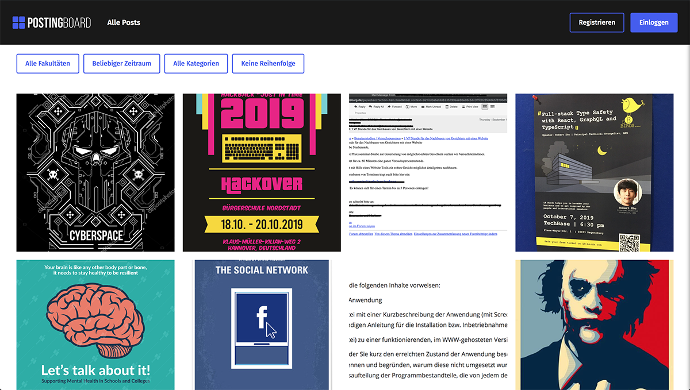
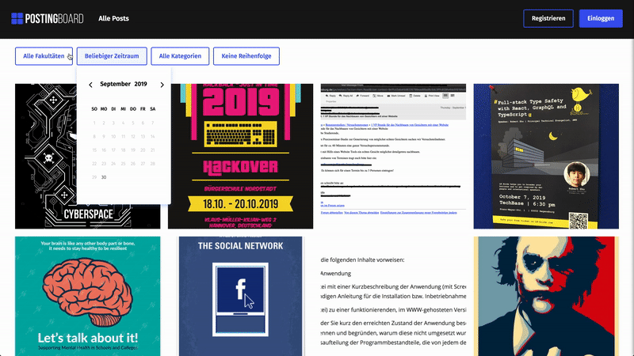
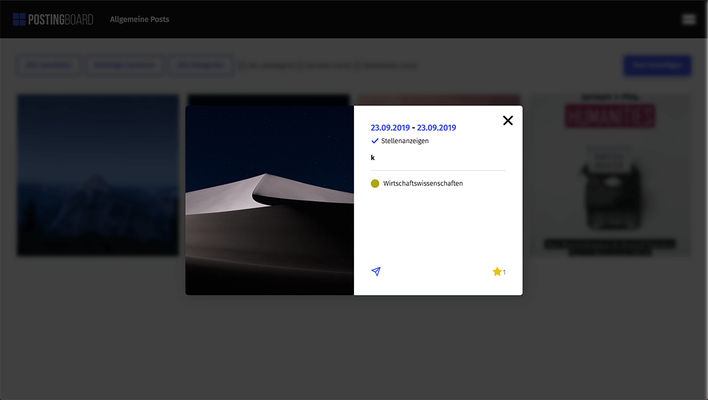
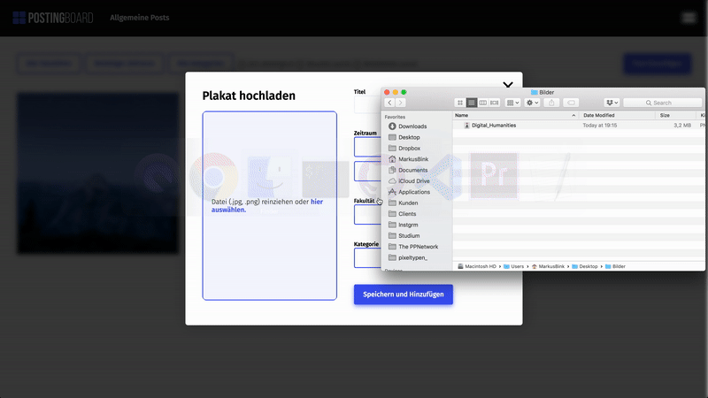
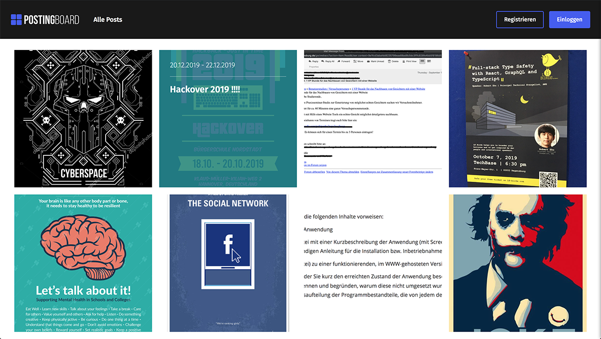
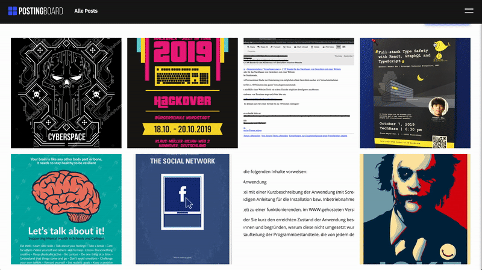
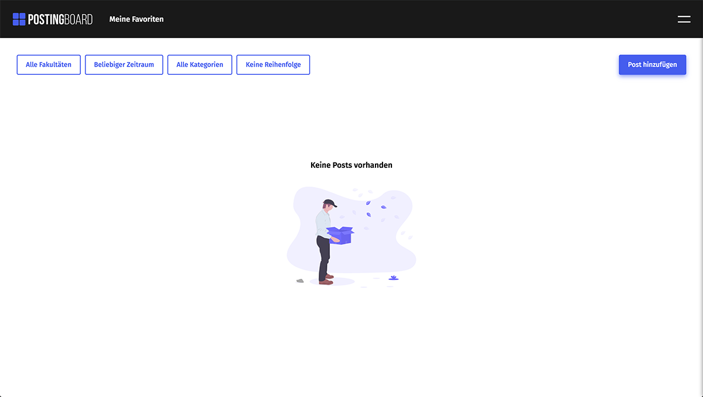
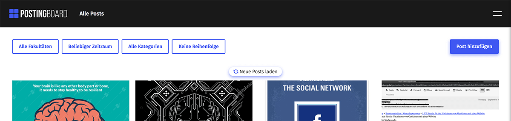
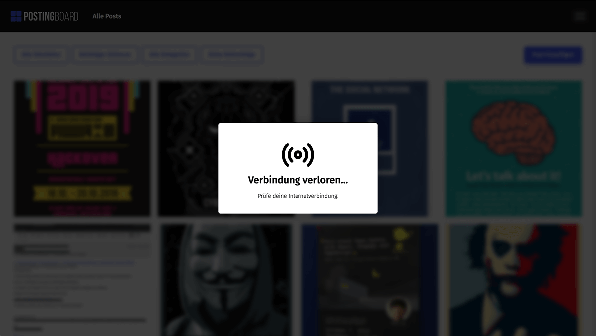
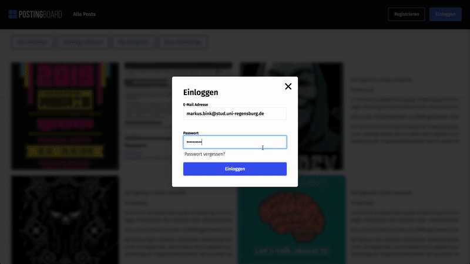

# Projekt

Mit der App "PostingBoard" können angehörige der Uni Regensburg, Firmen, Clubbetreiber uvm. Plakate über Veranstaltungen, VP-Stunden, Vorträge uvm. hochladen, speichern und filtern. Somit wird eine zentrale Anlaufstelle für alle Plakate geschaffen.

## Team

| Bild | Infos | Implementierte Komponenten
|-|-|-| 
 | **Markus Bink** Github-Nutzer: markusbink | Markus Bink hat die Komponente zur kompletten Nutzerverwaltung (wie Registrieren, Login, Password vergessen etc.) in Kombination mit der FirebaseAPI implementiert, sowie das komplette User Interface aufgesetzt. Des Weiteren hat er Benachrichtigungen für den User implementiert. |
 | **Timo Krapf** Github-Nutzer: timokrapf | Timo Krapf hat die Komponente zum Hochladen von neuen Posts und die Anzeigelogik, sowie den Umgang mit deren Speicherung, Bearbeitung und Löschen in der Datenbank mit Hilfe der FirebaseDB. Ferner hat er auch die Funktion zum Filtern der angezeigten Posts umgesetzt (Fakultät, Datum, Kategorie, Zeit). |
 | **Alex Odorizzi** Github-Nutzer: odorizziAlex | Alex Odorizzi hat den Custom-Kalender, sowie dessen dahintersteckende Logik implementiert. Zudem hat er die Funktion um Posts zu favorisieren, nach Favoriten und eigenen Posts zu filtern, sowie die Detailansicht mit Bearbeitungsfunktion und löschen aus dem UI umgesetzt. Außerdem hat er das Senden der .ics Datei implementiert und die Möglichkeit Shortcuts (Aktionen auf Enter, ESC, klick auf Overlay) zu verwenden.|

## Setup

Um die Anwendung lokal ausführen zu können, führen sie folgende Schritte aus:
1. Laden Sie sich das aktuelle Repository herunter (master-branch)
2. Öffnen Sie ein Terminal und gehen Sie in den Ordner
3. Um alle Dependencies zu installieren, führen Sie bitte einmalig `npm install` aus.
3. Danach können Sie über `npm start` einen lokalen Server starten und die App über die URL `http://localhost:8000/app` öffnen.

Falls Sie die Live-Version bevorzugen, können Sie diese [hier](https://postingboard.herokuapp.com/app/) ansehen.

## Beschreibung

Eine Übersicht aller ursprünglich geplanten und dokumentierten Features finden Sie [hier](Features.md).

#### 1. Ausgangslage: 
Ein Nutzer öffnet die Anwendung. Nun stehen der Person verschiedene Möglichkeiten zur Verfügung:  
1. Neuen Account über Registrieren-Button anlegen

2. Anmelden über Einloggen-Button (durch Passwort und E-Mail-Adresse). Falls der User sein Passwort vergessen hat, kann er ein neues Passwort anlegen (Klick auf "Passwort vergessen" mit zugehöriger E-Mail-Adresse -> E-Mail wird versendet -> Über Link in E-Mail kann das Wort zurückgesetzt werden).

3. Posts eingrenzen mit Hilfe der Filter unterhalb des App-Headers

4. Post anklicken, um sich Informationen (Titel, Zeitraum, Anzahl Interessierter, Fakultät, Kategorie) zu diesem anzeigen oder sich die Veranstaltung als ICS-Datei per E-Mail senden zu lassen. Ein Klick auf das Bild führt zu einer Vollansicht.

#### 2. Neuen Account anlegen:
User klickt auf Registrieren-Button. -> Registrieren-Popup öffnet sich. -> User muss nun einen Benutzernamen, E-Mail-Adresse und ein Passwort auswählen. -> Im Fall eines zu schwachen Passworts/nicht übereinstimmenden Passwörtern, zu kurzen Benutzernamens oder einer nicht gültigen E-Mail-Adresse (bereits vorhanden bzw. keine Uni-Regensburg-Adresse), wird der User informiert. Falls alle Eingaben korrekt sind, schließt sich das Popup, der User wird angemeldet und es wird versucht eine E-Mail an die ausgewählte Adresse zu senden. -> Funktioniert das Versenden der Mail, so wird der User aufgefordert sein Postfach zu prüfen. Andernfalls hat der User die Möglichkeit weitere Versuche zu starten (auch bei Neustart der Anwendung). -> War das Versenden nun erfolgreich, so kann der User durch Klick auf den Link in der Mail seinen Account verfizieren. Solange dies nicht geschehen ist, ist der User nicht in der Lage eigene Posts zu erstellen/bearbeiten/löschen. Ansonsten bleibt die Funktionalität prinzipiell gleich.

#### 3. Angemeldeter und verifizierter User:
1. Durch das Verifizieren hat der User die Möglichkeit selbst Posts hochzuladen. Dies funktioniert mit Hilfe eines Upload-Popups, in welchem der User zwangsweise (ansonsten Fehlermeldung und Upload nicht möglich) verschiedene Felder ausfüllen bzw. aus vorgefertigten Auswahlmöglichkeiten wählen muss (z.B. Startdatum und Enddatum, wobei Startdatum logischerweise früher als, oder gleich dem Enddatum sein muss). Zudem muss eine PNG- oder JPEG-Datei ausgewählt werden, welche anschließend in Form einer Vorschau im Popup zu sehen ist. Diese Datei, welche über einen Upload-Button oder via Drag-and-Drop ausgewählt werden kann (Bild wird komprimiert), ist nach dem Hochladen im Postingboard (Hauptteil/Body der Anwendung) zu finden.

2. Der User kann über Posts im Postingboard hovern, wodurch er einige der beim Upload spezifizierten Informationen angezeigt bekommt (z.B. steht die angezeigte Farbe für die jeweilige Fakultät). Durch Klick auf einen Post wird dem User mit Hilfe eines Popups eine detailiertere Ansicht gewährt und ein weiterer Klick auf das Bild führt zu einer Vollansicht. Dabei unterscheidet sich die Detailansicht je nachdem auf welchen Post man klickt. Klickt man auf einen eigenen Post, so sieht man die Anzahl Favorisierungen, kann aber selbst nicht auf favorisieren klicken. Zudem kann der User dann auch seine Posts bearbeiten (gleiches Verhalten wie beim Upload, mit bereits befüllten Informationen) und eigene Posts zu löschen (mit zusätzlichem Bestätigungsmechanismus). Klickt der User auf nicht-eigene Posts, so kann er sich die Veranstaltung als ICS-Datei per E-Mail senden lassen und diese dadurch in seinen externen Kalender eintragen. Außerdem kann er dann Posts favorisieren.

3. Als angemeldeter User kann man sein Menü öffnen. Ausgehend von diesem kann der User sich abmelden, sein Profil bearbeiten und löschen. Letzteres hat zur Folge, dass die von diesem User erstellten Posts gelöscht werden und sein Favorisieren rückgängig gemacht wird. Abmelden hat zur Folge, dass sich die App wieder in ihrer Ausgangslage befindet (Punkt 1). Account spezifische Angelegenheiten (z.B. Profil bearbeiten) sind kritisch und aus Sicherheitsgründen kann es vorkommen, dass der User sich zuvor erneut anmelden muss. Das Menü bietet zudem die Möglichkeit sich seine eigenen bzw. eigens favorisierte Posts anzeigen zu lassen (wird im Header der App als momentaner Status noch einmal verdeutlicht, was dem User die Bedienung erleichtern soll).

4. Im Header der App befindet sich, neben dem schon erwähnten Status (Meine Posts, Alle Posts, Meine Favoriten), auch der Registrier- und Anmeldebutton bzw. der Menü-Button. Im linken oberen Eck befindet sich zudem das Logo und der Titel der App, wobei ein Klick darauf dafür sorgt, dass die Posts neu geladen und die Filter zurückgesetzt werden.

5. Dem User stehen eine Reihe an Filtermöglichkeiten zur Verfügung. Man kann simultan nach Fakultät, Kategorie und Zeitpunkt filtern. Letzteres funktioniert folgendermaßen: Der User wählt ein Datum. Dadurch werden diejenigen Posts angezeigt, deren Zeitraum das ausgewählte Datum beinhalten. Außerdem kann der User die Anzeigereihenfolge bestimmen (Zuletzt hochgeladene Posts zuerst, Zeitlich absteigend oder am häufigsten favorisierte Posts zuerst). Wenn Posts neugeladen (Logo, Reload-Button etc.) werden, werden diese in zufälliger Reihenfolge angezeigt. Zeitlich absteigend Anzeigen funktioniert wie folgt: Je näher Start- aber auch Enddatum in der Zukunft sind, desto weiter oben werden sie anzeigt (z.B 06.10.19-06.10.19 vor 06.10.19-10.10.19 vor 07.10.19-08.10.19). Weitere Filterfunktionen befinden sich wie bereits erwähnt im Menü.

#### 4. Weitere Anmerkungen zur App:

- Befinden sich nach Neuladen der Posts oder einer Filterung mehr als 12 Posts in der App, so werden zuerst 12 Posts angezeigt und ein Button, um weitere 12 Posts anzuzeigen. Dieses Verhalten der App wiederholt sich bis es keine Posts mehr zum Anzeigen gibt.

- Befinden sich keine Posts in der Datenbank oder eine Filterung trifft für keinen Post zu, so wird dem User angezeigt, dass keine Posts vorhanden sind

- Fügt ein anderer User einen neuen Post hinzu, so wird dies allen anderen aktiven Usern in Echtzeit durch einen Button angezeigt. Ein Klick auf diesen Button sorgt dafür, dass die App mit Hilfe der Datenbank auf den neuesten Stand gesetzt wird. Gleiches passiert durch Reload etc..

- Zusätzlich zur Datenbank (Firebase Firestore und Storage) werden Cookies verwendet. Diese dienen an geeigneter Stelle zum Speichern von E-Mail-Adressen

- Besteht kein Internet bzw. verliertet der User die Verbindung dazu, so wird der User darüber informiert. Die App kann auch erst wieder richtig verwendet werden, wenn eine Verbindung zum Internet besteht.

- Für verschiedene Bestätigungs- und Fehlermeldungen werden eigens erstellte Toasts verwendet.

- Es werden Shortcuts (Klick auf Overlay, ESC-Taste, Enter-Taste) zum Bestätigen und/oder Schließen von Aktionen/Popups zur Verfügung gestellt. Diese funktionieren abhängig vom jeweiligen Popup.

#### 5. [Hier](Comments.md) geht es zu den Kommentaren.
